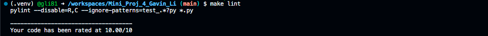

# Week 4 Mini Project

Gavin Li `gl183`

## Purpose of the project

The purpose of this week's mini project is to test different python versions in GitHub Action.

## Format, Lint, Matrix

Result for `make lint`:

Result for `make test`:

Result of GitHub Actions:

